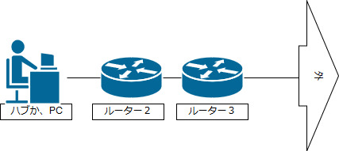

LAN プライベートねっと
WAN パブリックねっと コスト重視・公道をまたぐ

## シリアルケーブル
WAN
HDLC・SLIP・フレームリレー

ソフトウェア処理なので、CPUの処理能力に制限。おそい

２A/S ~128kb
2T 少し早い

通信速度はNTTから送られる、クロック信号に左右され。クロックに合わせてパケットを送る


Serialの設定
基本的にはEthernetと同じ
```
int serial `数字`/`数字`/`数字`
no shutdown
ip add `アドレス`  ` サブネット`
```
DCE側(ケーブルにはFC側と書いてある)には追加で通信レートを書く必要がある。6400のイメージ
`
clock rate `数字`
`


## ルータID
そのルータのIPの最大のもの。
OSPFでは、ルーターIDとしてループバックに大きなIPを設定することで固定する。

ルーティングテーブルは、マスクが深いほど優先



ルータ2に(送られてくるパケットすべてを外側のポートに流す)
```
ip route 0.0.0.0 0.0.0.0 `ルータ２側のルータ3のポートのIP`
```


スイッチングのトランク
```
swichport mode trunk
```

ルータのトランク(VLANをまとめて一つのポートで通信)
```
int `インターフェース名`.`VLAN番号(実は何でも構わないが・・・)` 
encapsulation dotQ1 `VLAN番号`
ip add `アドレス` `サブネット`

```


ネイティブVLAN
１つうのVLANだけ、VLANtaggingせずにおくる(ふつうはVLAN１)